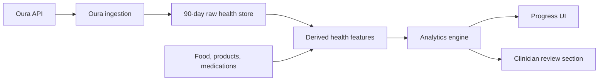

# Oura Progress Deep Analytics Design

Date: 2026-04-26

## Summary

Progress will become the primary user-facing analytics surface for Oura-backed health trends, medication adherence, food patterns, and lifestyle correlations. The system will store a rolling 90 days of server-only raw Oura payloads, derive compact feature tables for analysis, and generate safe insight summaries for the Progress UI.

The product boundary is explicit:

- Lifestyle-related insights can produce reversible user actions.
- Medication-related temporal patterns are clinician-review only.
- The app must not recommend stopping, changing, increasing, decreasing, skipping, doubling, replacing, or adjusting medication.

## Goals

- Use the existing `/app/progress` screen as the main analytics destination.
- Support deep analytics across Oura, food, products, hydration, medication adherence, protocols, and medication knowledge.
- Store enough source data to reproduce and improve analyses over a 90-day rolling window.
- Keep raw Oura payloads server-only.
- Support daily scheduled sync plus a user-triggered `Refresh now`.
- Degrade gracefully when optional Oura endpoints, scopes, or app data are unavailable.

## Non-Goals

- Do not build a separate primary Insights dashboard for this work.
- Do not provide medication-change instructions.
- Do not store raw Oura data indefinitely.
- Do not require webhooks for the first implementation.
- Do not expose raw Oura JSON directly to the browser.

## Architecture

The design uses five layers.

1. Oura ingestion handles OAuth token usage, API calls, endpoint availability, pagination, retries, and rate-limit behavior. It does not generate insights.
2. Raw health storage keeps server-only Oura payloads for a rolling 90-day retention window.
3. Derived feature generation converts Oura raw data and app data into stable daily, hourly, and event-level signals.
4. Analytics uses derived features to generate observations, lifestyle actions, clinician-review patterns, and data-quality messages.
5. Progress UI presents user-safe summaries and preserves the existing adherence dashboard.

The primary boundary is: raw data supports reproducibility, derived features support analytics, and Progress reads only safe summaries and feature aggregates.

## Data Model

### Raw Oura Documents

`oura_raw_documents`

- `id`
- `user_id`
- `connection_id`
- `endpoint`
- `oura_document_id`
- `local_date`
- `start_datetime`
- `end_datetime`
- `payload jsonb`
- `payload_hash`
- `fetched_at`
- `sync_run_id`
- `schema_version`

Raw payloads are retained for the rolling 90-day window and are server-only.

### Sync Metadata

`external_health_sync_runs`

- `id`
- `user_id`
- `provider`
- `sync_type`: `initial_backfill`, `daily`, or `manual_refresh`
- `range_start`
- `range_end`
- `status`
- `counts jsonb`
- `errors jsonb`
- `started_at`
- `finished_at`

This table supports auditability, progress state, partial-success handling, and data coverage reporting.

### Derived Health Features

`daily_health_features`

- `user_id`
- `date`
- `sleep_score`
- `readiness_score`
- `activity_score`
- `stress_summary`
- `spo2_average`
- `resting_heart_rate`
- `hrv_average`
- `steps`
- `active_calories`
- `workout_count`
- `bedtime_start`
- `bedtime_end`
- `data_quality jsonb`
- `source_payload_hashes jsonb`

`hourly_health_features` can be added for high-frequency signals such as heart rate, stress, or activity buckets. Analytics should not require scanning raw high-frequency payloads for normal user flows.

### Cross-Domain Features

`daily_lifestyle_features` combines health features with app-owned data:

- nutrition totals
- meal timing
- hydration
- tracked product categories
- medication adherence windows
- protocol event markers
- medication knowledge markers
- user tags or symptoms when available

### Insights

`correlation_insights`

- `user_id`
- `insight_type`: `lifestyle_action`, `clinician_review`, `observation`, or `data_quality`
- `title`
- `summary`
- `evidence jsonb`
- `confidence`
- `sample_size`
- `date_range`
- `status`

Medication-related insights must use `clinician_review` and must not be rendered as direct user recommendations.

## Sync Flow

### Initial Backfill

After successful Oura connection, run a 90-day backfill.

Core endpoint groups:

- daily summaries: `daily_sleep`, `daily_readiness`, `daily_activity`, `daily_spo2`, `daily_stress`
- sleep details: `sleep`, `sleep_time`
- activity details: `workout`
- heart rate: `heartrate`

Optional or extended endpoints should be fetched only when the token and account allow them:

- `daily_resilience`
- `daily_cardiovascular_age`
- `vO2_max`
- `ring_configuration`
- `ring_battery_level`
- `interbeat_interval`

The backfill stores raw payloads, computes derived features, and records endpoint coverage.

### Daily Scheduled Sync

Daily sync should fetch the last 7 days, not only yesterday, because Oura daily and sleep data can be revised after initial publication.

The sync should:

- upsert raw documents by endpoint, document id/date, and payload hash;
- recompute derived features for affected dates;
- regenerate insights for affected rolling windows;
- update sync metadata and endpoint coverage.

### Manual Refresh

`Refresh now` should be available from Progress and Settings.

Manual refresh should:

- fetch the last 14 days by default;
- show loading, success, partial success, failure, and rate-limited states;
- be rate-limited per user;
- update Progress when new derived features are available.

### Endpoint Failures

Sync must be partial-success tolerant.

- `401`: mark endpoint as token or scope unavailable. Prompt reconnect only when core endpoints fail.
- `403`: mark endpoint unsupported or unavailable for this account.
- `404`: mark optional endpoint unavailable unless it is a core endpoint.
- `429`: retry with backoff, then record partial sync if still failing.
- Network timeout: retry, then record partial sync if still failing.

Optional endpoint failures must not block sleep, readiness, activity, stress, SpO2, workout, or heart-rate sync when those endpoints succeed.

## Analytics Rules

Analytics compares each user against their own baseline.

Supported windows:

- 30 days
- 60 days
- 90 days

Supported lag windows:

- same day
- next day
- 2 days later

Every insight should include:

- date range
- sample size
- involved signals
- lag used
- confidence
- data coverage
- plain-language limitation

Insights should not be generated when sample size or data coverage is too low. In those cases, generate `data_quality` messages instead.

## Safety Rules

### Lifestyle Actions

`lifestyle_action` insights can suggest low-risk, reversible experiments such as:

- earlier dinner timing;
- more consistent bedtime;
- hydration consistency;
- lighter evening activity;
- meeting nutrition targets;
- improving logging completeness.

### Clinician Review

Medication-related patterns must use `clinician_review`.

Allowed framing:

- "Pattern detected for clinician review."
- "Discuss this trend with your clinician."
- "Do not change medication based on this insight alone."

Disallowed medication advice includes:

- stop
- change
- increase
- decrease
- reduce
- skip
- double
- adjust dose
- replace medication

The app may help users prepare for a clinician conversation, but it must not tell users what to do with medication.

## Progress UX

`/app/progress` becomes the main analytics destination. Existing adherence functionality should remain and become one part of a broader Progress and Recovery dashboard.

Recommended Progress sections:

- Top summary: adherence plus sleep, readiness, and recovery snapshot.
- Refresh status: `Refresh now`, last sync time, and data coverage.
- Time range switcher: 7, 30, 60, and 90 days.
- Current Progress: existing medication adherence, streak, protocol rings, and protocol breakdown.
- Health Trends: sleep, readiness, stress, HRV/resting heart rate, activity, and workouts.
- Lifestyle Patterns: food timing, nutrition targets, hydration, activity, and sleep/recovery links.
- Clinician Review: medication-related patterns only.
- Timeline: day-by-day overlay of doses, food, Oura signals, workouts, and sleep.
- Data Coverage: Oura connection, synced endpoints, missing scopes, insufficient logs, and optional endpoint availability.

`/app/settings` remains the place for Oura connection management and technical integration controls.

`/app/insights` should not become the primary user surface for this work. After Progress owns the functionality, Insights can be removed from bottom navigation or retained only as an internal or advanced diagnostics surface.

## Privacy and Access

- Raw Oura payloads are server-only.
- Progress reads derived features, sync state, coverage status, and insight summaries.
- Access tokens, refresh tokens, raw payloads, and sensitive health values must not be logged.
- Disconnecting Oura stops future sync.
- Raw Oura payload retention is rolling 90 days unless a later product decision adds export or archive controls.
- Medication-related analysis requires explicit consent and acknowledgement that the app does not provide medication-change instructions.
- Service role or server jobs can write raw and derived health data.
- User-facing APIs can read only the authenticated user's derived features, coverage status, sync status, and generated insights.

## Testing

### Sync Tests

- Oura pagination works.
- Initial backfill constructs a 90-day date range.
- Daily sync fetches a rolling recent window.
- Manual refresh fetches the configured short window.
- Optional `401`, `403`, and `404` endpoint failures do not fail the whole sync.
- `429` and network failures produce partial sync metadata.
- Raw payload upsert is idempotent by endpoint, document/date, and hash.

### Analytics Tests

- Derived features are generated from sample Oura payloads.
- Correlations require minimum sample size.
- Same-day, next-day, and 2-day lag windows work.
- Medication-related signals always produce `clinician_review`.
- Disallowed medication verbs are blocked from user-facing output.
- Missing food, health, or medication data produces `data_quality`, not fabricated insight cards.

### UI and E2E Tests

- Progress works when Oura is disconnected.
- Progress shows connected Oura status and last sync when available.
- `Refresh now` shows loading, success, partial success, failure, and rate-limited states.
- Lifestyle insights appear in Progress.
- Medication patterns appear only under Clinician Review.
- Existing adherence widgets still render after analytics additions.
- Mobile layout does not overflow after Progress expansion.

## Implementation Notes

The first implementation plan should be split into small slices:

1. Data model and migrations for raw Oura documents, sync runs, endpoint coverage, and derived health features.
2. Oura ingestion service updates for 90-day backfill, daily sync, manual refresh, endpoint availability, and idempotent raw upserts.
3. Derived feature generation for daily health, hourly health where needed, and cross-domain lifestyle features.
4. Analytics engine updates for safe insight categories, evidence, confidence, sample thresholds, and medication safety filters.
5. Progress UI integration with Refresh now, health trends, lifestyle patterns, clinician review, timeline, and data coverage.
6. Navigation cleanup so Progress is the main analytics surface.
7. Sync, analytics, and UI/E2E verification.

